# 🔗 Knexion - Agentic Knowledge Orchestrator

<div align="center">


**An intelligent AI system that transforms your study materials into an interconnected knowledge network**

*Connecting concepts, bridging knowledge gaps, delivering trusted answers.*

[🚀 Demo](#demo) • [📖 Features](#features) • [🏗️ Architecture](#architecture) • [🛠️ Installation](#installation) • [📊 Workflow](#workflow)

</div>

---

## 🎯 Project Overview

Knexion is an Agentic Knowledge Orchestrator designed specifically for students who struggle to connect concepts across their course materials. Instead of just retrieving information, Knexion builds a living knowledge graph that understands the relationships between concepts, bridging gaps with web search when needed, and delivering contextual answers that help students learn more effectively.

### 🎓 Built for Students

Every student faces the challenge of understanding how different concepts relate to each other across textbooks, lectures, and assignments. Knexion solves this by creating an intelligent knowledge network from your materials and providing answers with full context and concept relationships.

## ✨ Key Features

### 🧠 **Intelligent Knowledge Construction**
- **PDF Processing**: Upload textbooks, lecture notes, and study materials
- **Knowledge Graph Creation**: Automatically extracts entities, concepts, and relationships
- **Vector Embeddings**: Semantic search across your entire knowledge base
- **Concept Mapping**: Visual representation of how ideas connect

### 🔍 **Hybrid Retrieval System**
- **Graph-Based Reasoning**: Understands conceptual relationships
- **Vector Similarity Search**: Finds semantically related content
- **Adaptive Gap Bridging**: Automatically searches the web when knowledge is incomplete
- **Context Fusion**: Combines multiple sources for comprehensive answers

### 🤖 **Agentic Workflow**
- **Quality Validation**: Multiple layers of answer verification
- **Hallucination Detection**: Ensures responses are grounded in facts
- **Web Search Integration**: Fills knowledge gaps with external sources
- **Interactive Learning**: Provides knowledge graph visualizations for better understanding

### 📚 **Student-Centric Design**
- **Conversational Interface**: Ask questions in natural language
- **Visual Context**: See how concepts relate through interactive graphs
- **Source Transparency**: Full traceability of answers to source materials
- **Multi-Document Support**: Works across entire course materials

---

## 🏗️ System Architecture

```mermaid
graph TB
    subgraph "📁 Input Layer"
        A[PDF Documents] --> B[Document Processing]
        B --> C[Text Chunking]
    end
    
    subgraph "🧠 Knowledge Construction"
        C --> D[Knowledge Graph Extraction]
        C --> E[Vector Embeddings]
        D --> F[Entity & Relationship Storage]
        E --> G[TiDB Vector Store]
    end
    
    subgraph "🔍 Retrieval Layer"
        H[User Query] --> I[Hybrid Retrieval]
        I --> J[Graph Search]
        I --> K[Vector Search]
        F --> J
        G --> K
    end
    
    subgraph "🤖 Agentic Processing"
        L[Knowledge Integration] --> M[Answer Generation]
        M --> N[Quality Validation]
        N --> O[Web Search if Needed]
        O --> M
        J --> L
        K --> L
    end
    
    subgraph "📊 Output Layer"
        N --> P[Final Answer]
        P --> Q[Knowledge Graph Visualization]
        P --> R[Source Documents]
    end

    classDef input fill:#e1f5fe,stroke:#01579b,stroke-width:2px
    classDef knowledge fill:#f3e5f5,stroke:#4a148c,stroke-width:2px
    classDef retrieval fill:#e8f5e8,stroke:#1b5e20,stroke-width:2px
    classDef agent fill:#fff3e0,stroke:#e65100,stroke-width:2px
    classDef output fill:#fce4ec,stroke:#880e4f,stroke-width:2px

    class A,B,C input
    class D,E,F,G knowledge
    class H,I,J,K retrieval
    class L,M,N,O agent
    class P,Q,R output
```



## 🤖 Agentic Workflow

The core intelligence of Knexion lies in its sophisticated decision-making workflow:


## 📋 Complete Application Workflow

```mermaid
sequenceDiagram
    participant S as 👨‍🎓 Student
    participant UI as 🖥️ Streamlit Interface
    participant API as 🔄 FastAPI Backend
    participant KG as 📊 Knowledge Graph
    participant VS as 🔍 Vector Store
    participant LLM as 🤖 LLM Agent
    participant WEB as 🌐 Web Search

    S->>UI: Upload PDF Materials
    UI->>API: Process Documents
    API->>KG: Extract Entities & Relationships
    API->>VS: Create Vector Embeddings
    API->>UI: Confirm Knowledge Base Created
    
    S->>UI: Ask Question
    UI->>API: Send Query
    API->>LLM: Initialize Agent Workflow
    
    LLM->>KG: Retrieve Relevant Concepts
    LLM->>VS: Semantic Document Search
    LLM->>LLM: Grade Document Relevance
    
    alt Documents Sufficient
        LLM->>LLM: Generate Answer
        LLM->>LLM: Validate Quality & Grounding
    else Knowledge Gap Detected
        LLM->>WEB: Search External Sources
        LLM->>LLM: Integrate Web Results
        LLM->>LLM: Generate Enhanced Answer
    end
    
    LLM->>API: Return Answer + Context
    API->>UI: Deliver Response
    UI->>S: Show Answer + Knowledge Graph + Sources
```



---

## 🛠️ Technology Stack

### 🧠 **AI & LLM Framework**
- **LangGraph**: Advanced agent workflow orchestration
- **Google Gemini**: Primary LLM for reasoning and generation
- **OpenAI Embeddings**: Vector embeddings for semantic search
- **DSPy**: Structured prompting and knowledge extraction
- **Tavily Search**: Web search integration

### 🗄️ **Database & Storage**
- **TiDB**: Vector database for embeddings and knowledge graph storage
- **SQLite**: Conversation state management and checkpointing
- **Pyvis**: Interactive knowledge graph visualization

### 🚀 **Application Framework**
- **Streamlit**: Interactive web interface
- **FastAPI**: High-performance backend API
- **LangChain**: Document processing and retrieval
- **Pydantic**: Data validation and structured outputs

---

## 📥 Installation & Setup

### 1️⃣ **Clone the Repository**
```bash
git clone https://github.com/yourusername/knexion.git
cd knexion
```

### 2️⃣ **Create Virtual Environment**
```bash
python -m venv venv
source venv/bin/activate  # On Windows: venv\Scripts\activate
```

### 3️⃣ **Install Dependencies**
```bash
pip install -r requirements.txt
```

### 4️⃣ **Environment Configuration**
Create a `.env` file with the following variables:

```env
# LLM API Keys
OPENAI_API_KEY=your_openai_api_key
GOOGLE_API_KEY=your_google_api_key

# TiDB Configuration
TIDB_CONNECTION_STRING=your_tidb_connection_string
TIDB_HOST_NAME=your_tidb_host
TIDB_PORT_NUMBER=4000
TIDB_USERNAME=your_tidb_username
TIDB_PASSWORD=your_tidb_password
TIDB_DATABASE_NAME=your_database_name

# Web Search
TAVILY_API_KEY=your_tavily_api_key
```

### 5️⃣ **Create Cache Directory**
```bash
mkdir -p .cache/graph
```

---

## 🚀 Usage

### **Start the Application**

**1. Start the Backend Server:**
```bash
python api_server.py
```

**2. Launch the Frontend Interface:**
```bash
streamlit run streamlit_interface.py
```

### **Using Knexion for Learning**

1. **📁 Upload Study Materials**
   - Upload PDF textbooks, lecture notes, or course materials
   - System automatically processes and creates knowledge base
   - Wait for confirmation of successful processing

2. **💭 Ask Questions**
   - Type questions in natural language
   - Ask about concepts, relationships, or specific topics
   - Request explanations or connections between ideas

3. **🔍 Explore Context**
   - Click "View Context" on any answer
   - Explore interactive knowledge graphs
   - See source documents that informed the answer

4. **📚 Build Understanding**
   - Ask follow-up questions to deepen understanding
   - Explore concept relationships through visualizations
   - Use multiple conversation threads for different topics

---

## 📁 Project Structure

```
knexion/
├── streamlit_interface.py     # Streamlit web interface
├── api_server.py             # FastAPI backend server
├── workflow_orchestrator.py  # LangGraph agent workflow
├── llm_chains.py            # LLM evaluation chains
├── knowledge_store.py       # Database operations (TiDB)
├── requirements.txt         # Python dependencies
├── .env.example            # Environment variables template
├── .cache/                 # Cached knowledge graphs
│   └── graph/             # Generated visualizations
└── README.md              # Project documentation
```

## 🎓 Use Cases for Students

### 📖 **Literature Studies**
- Upload multiple novels and analyze thematic connections
- Understand character relationships across different works
- Explore literary movements and their influences

### 🧬 **Science Courses**
- Connect biological processes across different chapters
- Understand chemical reactions and their applications
- Link physics concepts to real-world phenomena

### 📚 **History Learning**
- Map historical events and their causal relationships
- Connect different time periods and civilizations
- Understand the progression of ideas and movements

### 💼 **Business Studies**
- Relate theoretical concepts to case studies
- Understand market dynamics and economic principles
- Connect strategy frameworks to practical applications

---

## 🎯 Key Benefits for Students

### 🧩 **Concept Connection**
- Automatically identifies relationships between ideas
- Helps understand how concepts build upon each other
- Reveals hidden connections across course materials

### 🎯 **Personalized Learning**
- Adapts to your specific study materials
- Maintains conversation context for deeper discussions
- Provides explanations tailored to your knowledge level

### 🔍 **Research Enhancement**
- Automatically finds relevant external sources
- Validates information against multiple sources
- Provides comprehensive answers with full context

### 📊 **Visual Learning**
- Interactive knowledge graph visualizations
- See concept relationships at a glance
- Better understanding through visual connections

---

## 🚀 Future Enhancements

### 📱 **Enhanced User Experience**
- Mobile application for on-the-go studying
- Voice interaction for hands-free learning
- Integration with note-taking applications
- Collaborative study group features

### 🧠 **Advanced AI Capabilities**
- Multi-modal support (images, diagrams, videos)
- Personalized learning path recommendations
- Automatic quiz generation from materials
- Learning progress tracking and analytics

### 🔗 **Extended Integrations**
- Integration with popular LMS platforms
- Support for more document formats
- Real-time collaboration features
- Export capabilities for notes and summaries

---

## 🤝 Contributing

We welcome contributions from students, educators, and developers! Here's how you can help:

1. **🍴 Fork the repository**
2. **🌿 Create a feature branch** (`git checkout -b feature/amazing-feature`)
3. **💻 Make your changes** and test thoroughly
4. **📝 Commit your changes** (`git commit -m 'Add amazing feature'`)
5. **🚀 Push to the branch** (`git push origin feature/amazing-feature`)
6. **🎯 Open a Pull Request**

### 🐛 **Bug Reports**
Found an issue? Please open a GitHub issue with:
- Detailed description of the problem
- Steps to reproduce the issue
- Expected vs actual behavior
- Screenshots if applicable

---

## 📄 License

This project is licensed under the MIT License - see the [LICENSE](LICENSE) file for details.

---

## 🙏 Acknowledgments

### 🎓 **Educational Community**
- Students worldwide who inspired this project
- Educators providing feedback on learning challenges
- Open source community for amazing tools and libraries

### 🛠️ **Technology Partners**
- **TiDB** for vector database capabilities
- **LangChain** for document processing frameworks
- **Streamlit** for rapid UI development
- **OpenAI** and **Google** for AI capabilities

---

<div align="center">

**Built with ❤️ for Students Everywhere**

### 📞 Contact & Support

[](https://github.com/yourusername/knexion)
[](mailto:your.email@example.com)

**🔗 Transforming the way students learn, one connection at a time 🔗**

---

<sub>⭐ Star this repo if it helps your learning journey! ⭐</sub>

</div>